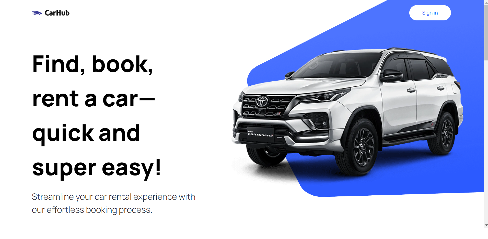
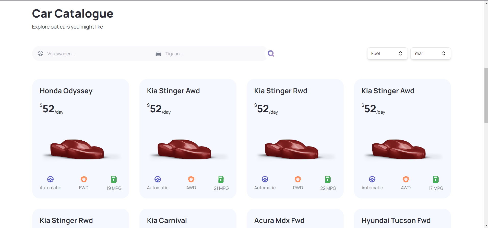

# 🚀 Car Rent

Welcome to the cutting-edge Next.js 13 application project, Car Rent! 🚗 In this exciting journey, we leverage the latest advancements in Next.js 13 to create a modern and feature-rich application. Explore the power of server-side rendering and the App Router to craft a state-of-the-art experience for your users.

## 🌟 Key Highlights

By working on this project, you will:

- 🛣️ **Leverage Next.js 13 Features**: Master the Next.js 13 App Router and Server Side Rendering, boosting your application's performance and user experience.

- 🔍 **Implement Advanced Search**: Acquire skills to incorporate advanced search functionality, enabling users to find information efficiently.

- 🎯 **Create Filtering Capabilities**: Learn how to build effective filtering features for users to narrow down content, enhancing usability.

- 🌐 **Optimize Metadata and SEO**: Discover SEO best practices to improve your application's visibility and discoverability on search engines.

- 🎨 **Design Custom UI Elements**: Gain the ability to design and integrate custom filter controls, comboboxes, and modal elements to tailor your app's interface.

- 📂 **Maintain Organized Code**: Practice efficient project file and folder organization for better codebase management as your app scales.

- 🧹 **Embrace Clean Code**: Follow clean code principles, ensuring readability, understanding, and long-term sustainability for collaborative development.

## 📜 Getting Started

1. Clone this repository to your local machine.
2. Run `npm install` to install project dependencies.
3. Start the development server with `npm run dev`.
4. Explore and build upon the Next.js 13 application!

## 📷 Screenshots

## 🤝 Contributing

Contributions are welcome! Feel free to open issues and submit pull requests to help improve this project.
